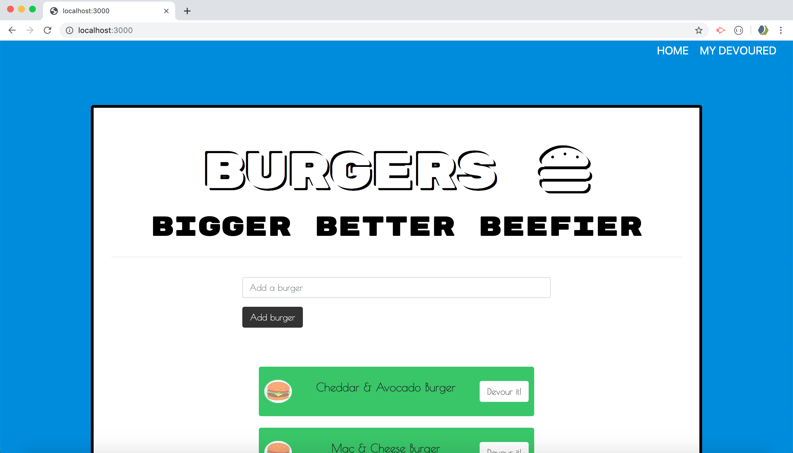

# burger

## Overview 
In this assignment, you'll create a burger logger with MySQL, Node, Express, Handlebars and a homemade ORM (yum!). Be sure to follow the MVC design pattern; use Node and MySQL to query and route data in your app, and Handlebars to generate your HTML.

## App Setup
npm init, npm install express, express-handlebars, install mysql

## DB Setup
schema.sql and seeds.sql

## Screenshots to see how the Burger App works 
Initial mySQL db screen where I originally created the table and names for my burgers, id and devoured status 

Server listenening.. This is what the Burger App page looks like on first visit (which includes all the burgers you see in the DB screenshot above.)

