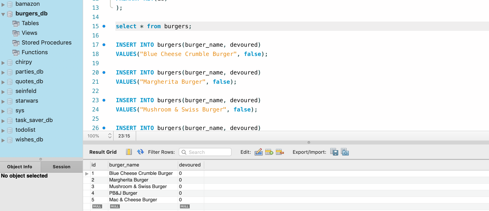
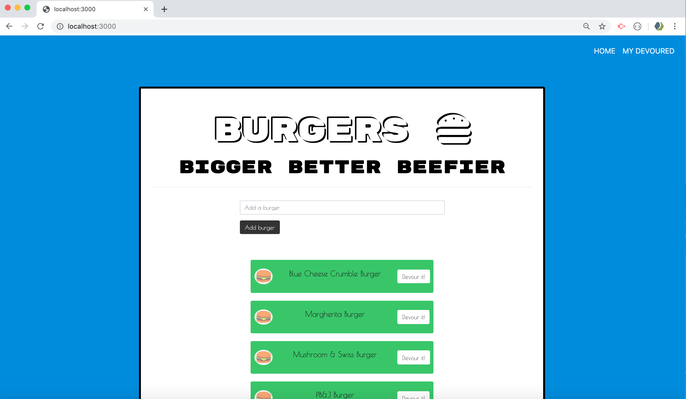
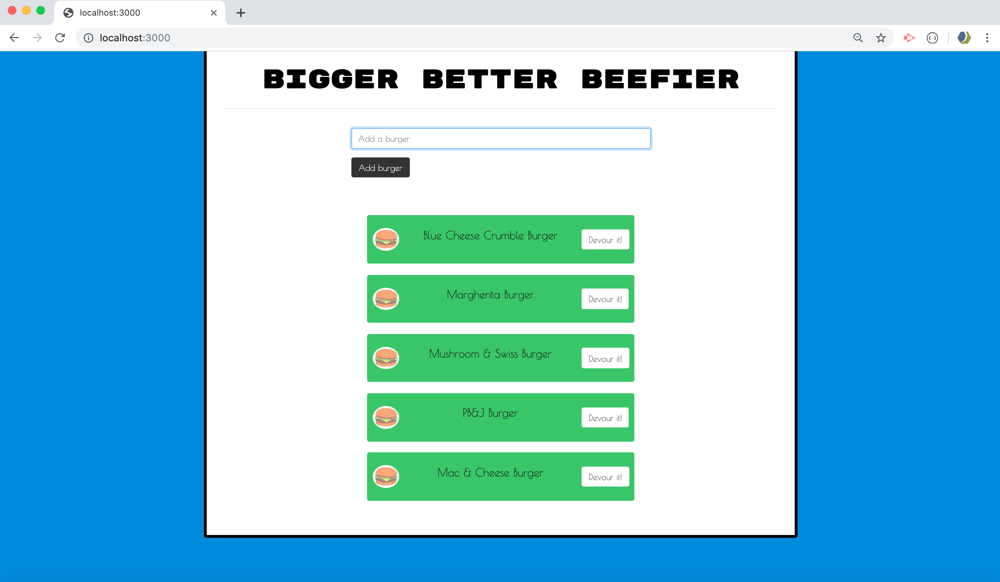
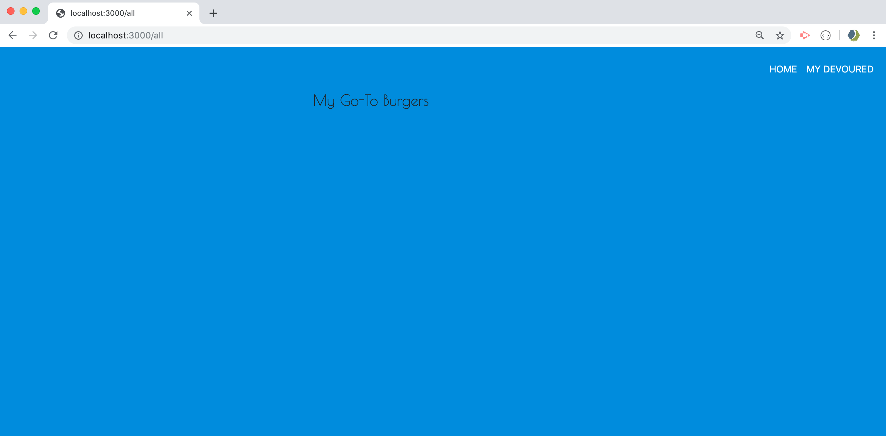
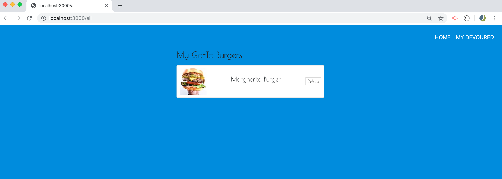
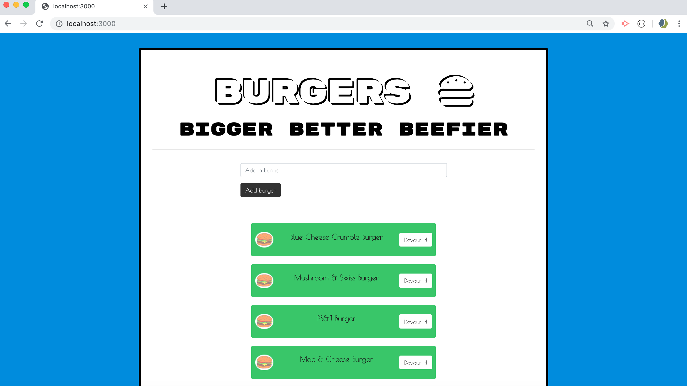
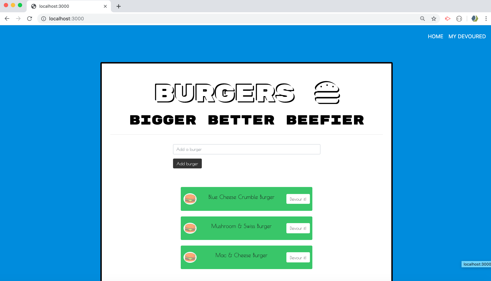
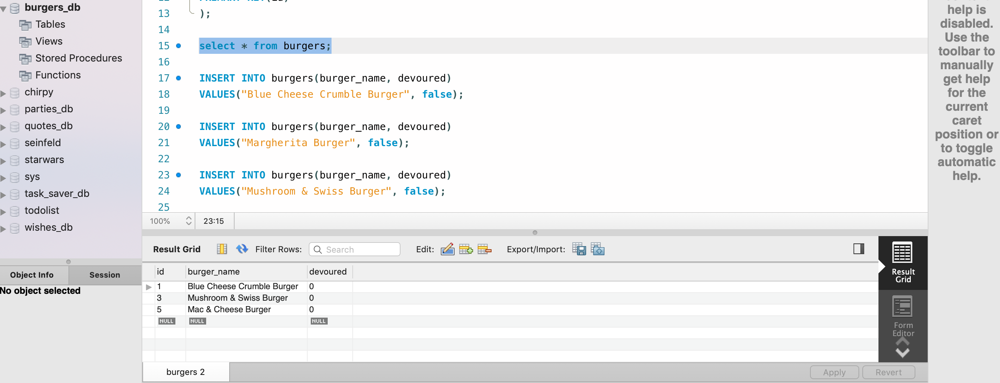
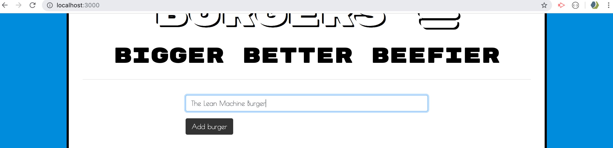

# burger

## Overview 
In this assignment, you'll create a burger logger with MySQL, Node, Express, Handlebars and a homemade ORM (yum!). Be sure to follow the MVC design pattern; use Node and MySQL to query and route data in your app, and Handlebars to generate your HTML.

## App Setup
npm init, npm install express, express-handlebars, install mysql

## DB Setup
schema.sql and seeds.sql

## Demo Through Screenshots to see how the Burger App works 
Initial mySQL db screen where I originally created the table for my burgers including id, names, and devoured status 

Server listenening.. This is what the Burger App page looks like on first visit (which includes all the burgers you see in the DB screenshot above.). 

There is a link at the top of page that displays the burgers when the user clicks the "Devour It!" button. 

In this example, I chose to click Devour it button for the Margherita Burger, which now displays it on the 'My Devoured' Page and not on the home page.

Another burger added to Devour Page

If the user wants to delete a burger, it will be removed from the db. I deleted both our PB&J and Margherita burgers, which leave me with the 3 left. 

DB now

You can also add your favorite burger in the form provided and it will be appended to the end of the existing burger list!

ENJOY!

